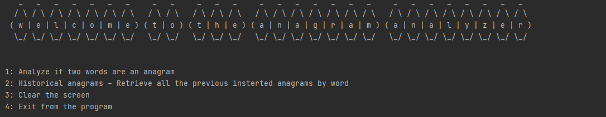
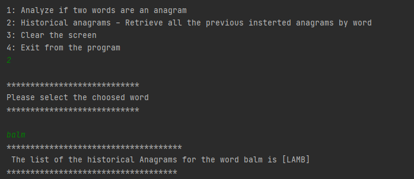

#Anagram Analyzer App

This application is a simple Java application that allows the user to detect if two words are an anagram.
In addition, the application internally manage the historical anagrams previously detected by the application itself
and the user can search them introducing a single word as parameter.

## Prerequisite

**Java 11** is required to run the application

## Guidelines

First of all, clone this repository in your local machine,
once you have done this, let's see the next steps:

### 1. Build the application

Build the java application app with gradle (gradle task build).
This will generate the jar **anagram-analyzer-app-{version}.jar** into the folder /build/libs/anagram-analyzer-app-{version}.jar

### 2. Execute as a JAR

Once the jar **anagram-analyzer-app-{version}** has been generated, 
you can launch the application with a cmd where the directory is the one that contains the jar
with the command

```
java -jar anagram-analyzer-app-{version}.jar
```
An example :


### 3. Run from the IDE

Once you have cloned the application in your local machine from git,
you can use any IDE and import the application as java project.
To run the application, you need to run **AnagramAnalyzerApp.java** main class
The path for the main class is /src/main/java/com/beyonnex/anagramanalyzer/AnagramAnalyzerApp.java 


### 4. Export the JAR in another project and use it as a library

After the build of the project, you can use the **anagram-analyzer-app-{version}.jar** 
as a library. So, basically, you can import the jar in another project and 
this will allows the project to use the **AnagramAnalyzerManager** class.
This class has the following methods available
```
/**
* This method return a boolean value,
* based on the word1 and word2 inputs.
* Return true in case the alphanumeric elements of the two words are the same
**/
1. AnagramAnalyzerManager.wordsAreAnagram(String word1, String word2) 

/**
 * This method return a boolean value,
 * based on the word1 and word2 inputs.
 * Return true in case the alphanumeric elements of the two words are the same
 * If the words are anagrams, than the values are saved
 * in memory for the historical anagrams functionality,
 * where you can retrieve all the anagrams inserted previously
 * refer to @getHistoricalAnagramsByWord methods
 **/
2. AnagramAnalyzerManager.checkIfWordsAreAnagramAndStoreResultInMemory(String word1, String word2)


/**
 * This method return a list of all the anagrams previously
 * inserted in the app based on the parameter word
 **/
3. AnagramAnalyzerManager.getHistoricalAnagramsByWord(String word)

/**
 * This method delete all the historical anagrams from the app memory
 **/
4. AnagramAnalyzerManager.clearHistoricalAnagrams()

```

## Use the application

Once you run the application (with method 2 or 3 descripted previously) the user will
see this menu



### 1.Analyze if two words are an anagram
This option will allows the user to insert two words and coming back with 
the result of the anagram comparison


### 2.Historical anagrams - Retrieve all the previous insterted anagrams by word
This option will allow the user to insert a word and receive back the list
of all the historical anagrams present in the system based on the selected word


### 3. Clear the screen
This option will clear the screen

### 4. Exit from the program
This option will end the application execution

## License
"This project is licensed under the terms of the **MIT** license
The code in this repository is covered by the included license.

## Support
Please contact falangafrancesco@gmail.com